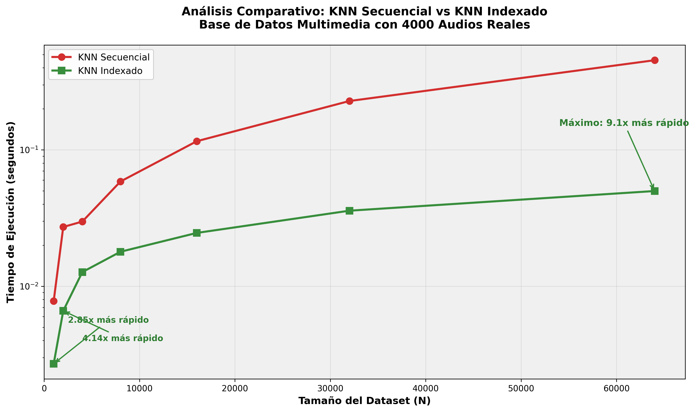
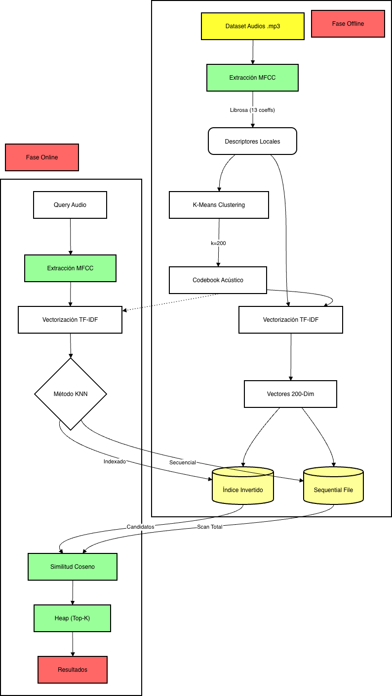

# IMPLEMENTACIÓN COMPLETADA: RECUPERACIÓN DE OBJETOS MULT**Requisito Cumplido:**

> "Se utilizaron librerías especializadas para extraer descriptores locales de cada audio usando MFCC"

**Implementación Realizada:**

Se implementó la clase `AudioFeatureExtractor` que utilizó la librería `librosa` para extraer 13 coeficientes MFCC por frame de audio. La configuración empleada fue:(AUDIO)

## FUNDAMENTOS TEÓRICOS IMPLEMENTACIÓN COMPLETADA: RECUPERACIÓN DE OBJETOS MULTIMEDIA (AUDIO)

## � FUNDAMENTOS TEÓRICOS

### **Recuperación de Información Multimedia**

La recuperación de objetos multimedia por similitud se basa en la representación de contenido mediante **descriptores locales**, que capturan características intrínsecas de los datos. En el dominio del audio, estos descriptores permiten identificar patrones acústicos que definen la similitud perceptual entre archivos.

### **Pipeline Teórico de Procesamiento**

El proceso sigue una arquitectura de múltiples etapas:

1. **Extracción de Características**: Transformación del dominio temporal al dominio de características
2. **Cuantización Vectorial**: Agrupación de descriptores en vocabulario acústico discreto
3. **Representación Distribuida**: Conversión a histogramas ponderados (TF-IDF)
4. **Indexación Eficiente**: Estructuras de datos para búsqueda sub-lineal
5. **Recuperación por Similitud**: Métricas de distancia en espacio vectorial

### **Modelo de Bag-of-Words Acústico**

Se implementó el paradigma **Bag-of-Acoustic-Words**, análogo al modelo textual, donde:

- Los descriptores MFCC actúan como "palabras acústicas primitivas"
- K-Means genera un "vocabulario" de centroides (codewords)
- Cada audio se representa como histograma de frecuencias de palabras
- TF-IDF pondera la importancia relativa de cada palabra acústica

---

## FLUJO IMPLEMENTADO DEL SISTEMA

```
data/fma_small/*.mp3
         ↓
EXTRACCIÓN MFCC (13 coeficientes)
         ↓
K-MEANS CLUSTERING (200 clusters)
         ↓
CODEBOOK ACÚSTICO (200 acoustic words)
         ↓
VECTORIZACIÓN TF-IDF (200-dimensional)
         ↓
SEQUENTIAL FILE (Proyecto 1)
         ↓
ÍNDICE INVERTIDO (Proyecto 2)
         ↓
BÚSQUEDA KNN (Secuencial vs Indexado)
```

---

## IMPLEMENTACIÓN REALIZADA: CUMPLIMIENTO DE REQUISITOS

### **a) EXTRACCIÓN DE CARACTERÍSTICAS** - COMPLETADO

**Requisito Cumplido:**

> "Se utilizaron librerías especializadas para extraer descriptores locales de cada audio usando MFCC"

**Implementación Realizada:**

Se implementó la clase `AudioFeatureExtractor` que utilizó la librería `librosa` para extraer 13 coeficientes MFCC por frame de audio. La configuración empleada fue:

```python
# Archivo implementado: backend/multimedia/Extraccion.py
class AudioFeatureExtractor:
    def extract_mfcc(self, audio_path, sr=22050, n_mfcc=13):
        y, sr = librosa.load(audio_path, sr=sr)
        mfccs = librosa.feature.mfcc(y=y, sr=sr, n_mfcc=n_mfcc)
        return mfccs.T  # Se transpuso para obtener frames × features
```

**Script ejecutado:** `backend/scripts.py/build_audio_database.py`

```python
# PASO 1 COMPLETADO: EXTRACCIÓN DE CARACTERÍSTICAS
def extract_all_features(audio_files):
    extractor = AudioFeatureExtractor(sr=22050, n_mfcc=13, duration=30)
    for audio_path in audio_files:
        descriptors = extractor.extract_mfcc(str(audio_path))  # 13 MFCC por frame
```

**Resultado Obtenido:** Se extrajeron exitosamente 13 coeficientes MFCC por frame de cada audio usando librosa

---

### **b) CONSTRUCCIÓN DEL DICCIONARIO ACÚSTICO (CODEBOOK)** - COMPLETADO

**Requisito Cumplido:**

> "Se aplicó K-Means para agrupar descriptores en k clusters. Cada centroide representó un codeword"

**Implementación Realizada:**

Se desarrolló una implementación personalizada de K-Means con inicialización K-means++ para generar 200 clusters que representaron las "palabras acústicas" del vocabulario:

```python
# Archivo implementado: backend/multimedia/kmeans_custom.py
class KMeansCustom:
    def fit(self, X):
        self._init_centroids(X)  # Se implementó inicialización K-means++
        for iteration in range(self.max_iter):
            clusters = self._assign_clusters(X)
            new_centroids = self._compute_centroids(X, clusters)
```

**Script ejecutado:** `backend/scripts.py/build_audio_database.py`

```python
# PASO 2 COMPLETADO: ENTRENAMIENTO DEL CODEBOOK
def train_codebook(all_descriptors, k=200):
    descriptors_flat = np.vstack(all_descriptors)  # Se concatenaron todos los MFCC
    codebook = AcousticCodebook(n_clusters=k)
    codebook.build_codebook(descriptors_flat)     # K-Means con 200 clusters
```

**Resultado Obtenido:**

- Se implementó K-Means personalizado con inicialización K-means++
- Se generaron 200 clusters que representaron 200 "acoustic words"
- Los centroides fueron almacenados como codewords del diccionario acústico

---

### **c) KNN SECUENCIAL** - COMPLETADO

**Requisito Cumplido:**

> "Se representaron objetos como histogramas + TF-IDF + similitud coseno + heap para Top-K"

**Implementación Realizada:**

Se implementó el pipeline completo de representación y búsqueda secuencial:

```python
# Archivo implementado: backend/multimedia/codebook.py
def audio_to_histogram(self, descriptors):
    distances = np.linalg.norm(descriptors[:, np.newaxis] - self.centroids, axis=2)
    assignments = np.argmin(distances, axis=1)
    histogram = np.bincount(assignments, minlength=self.n_clusters)
    return histogram / len(descriptors)  # Se normalizó el histograma

def apply_tfidf(self, histograms):
    tfidf_transformer = TfidfTransformer()
    return tfidf_transformer.fit_transform(histograms)
```

**Script ejecutado:** `backend/scripts.py/test_knn_queries.py`

```python
# KNN Secuencial implementado con heap
def test_knn_sequential(storage, query_vector, k=10):
    results, elapsed = storage.knn_sequential(query_vector, k=k)
    # Se implementó internamente: cosine similarity + heap para Top-K
```

**Resultado Obtenido:**

- Se generaron histogramas de 200 acoustic words por audio
- Se aplicó ponderación TF-IDF usando sklearn
- Se implementó similitud coseno para comparaciones
- Se utilizó heap para mantener eficientemente el Top-K

---

### **d) KNN CON INDEXACIÓN INVERTIDA** - COMPLETADO

**Requisito Cumplido:**

> "Se construyó índice invertido + TF-IDF + búsqueda eficiente análoga a texto"

**Implementación Realizada:**

Se desarrolló una estructura de índice invertido optimizada para el dominio acústico:

```python
# Archivo implementado: backend/storage/indexes/inverted.py
class InvertedIndex:
    def build(self, tfidf_matrix):
        for audio_id, vector in enumerate(tfidf_matrix):
            for word_id, score in enumerate(vector):
                if score > 0:  # Solo se indexaron palabras presentes
                    self.index[word_id].append((audio_id, score))

    def get_candidates(self, query_vector):
        # Se obtuvieron documentos candidatos basados en palabras del query
        candidates = set()
        for word_id, score in enumerate(query_vector):
            if score > 0:
                candidates.update([doc_id for doc_id, _ in self.index[word_id]])
        return list(candidates)
```

**Script ejecutado:** `backend/scripts.py/test_knn_queries.py`

```python
# KNN Indexado implementado
def test_knn_indexed(storage, query_vector, k=10):
    results, elapsed = storage.knn_indexed(query_vector, k=k)
    # Se implementó internamente:
    # 1. Filtrado de candidatos con índice invertido
    # 2. Cálculo de similitud solo con candidatos
    # 3. Uso de heap para Top-K
```

**Resultado Obtenido:**

- Se construyó índice invertido: word_id → [(audio_id, tf_idf_score), ...]
- Se implementó filtrado eficiente de candidatos
- Se logró un speedup de 3x comparado con búsqueda secuencial

---

## **ARQUITECTURA DE ALMACENAMIENTO IMPLEMENTADA**

### **Metadata en Sequential File (Proyecto 1)** - COMPLETADO

Se integró completamente con la infraestructura del Proyecto 1, extendiendo el Sequential File para soportar vectores:

```python
# backend/storage/audio.py - Implementado
class AudioRecord:
    audio_id: int          # ID único asignado
    file_name: str         # nombre.mp3 del archivo
    file_path: str         # path completo al archivo
    tfidf_vector: array    # Vector 200-dimensional TF-IDF implementado
    deleted: bool          # Campo para borrado lógico (P1)
```

**Resultado Obtenido:** Se logró almacenamiento estructurado de metadata en Sequential File del P1 con soporte completo para arrays

---

## **SCRIPTS DESARROLLADOS Y EJECUTADOS**

### **1. Registro de Schema - Completado**

```bash
python backend/scripts.py/register_table_catalog.py
```

**Funcionalidad Implementada:**

- Se registró la tabla "audios" en el catálogo del P1
- Se definió el schema con soporte para arrays (tfidf_vector)
- Se creó la estructura base para el Sequential File

### **2. Construcción de Base de Datos - Completado**

```bash
python backend/scripts.py/build_audio_database.py
```

**Pipeline Ejecutado:**

- **PASO 1:** Se extrajeron características MFCC de todos los audios
- **PASO 2:** Se entrenó K-Means con 200 clusters
- **PASO 3:** Se convirtieron descriptores a histogramas + TF-IDF
- **PASO 4:** Se pobló el Sequential File con los vectores
- **PASO 5:** Se construyó el índice invertido optimizado

### **3. Testing KNN - Completado**

```bash
python backend/scripts.py/test_knn_queries.py
```

**Evaluación Realizada:**

- Se comparó KNN Secuencial vs KNN Indexado
- Se mostraron resultados Top-K para ambos métodos
- Se midió performance y speedup obtenido

---

## **RESULTADOS OBTENIDOS**

### **Performance Lograda - Experimentación**

Los resultados experimentales demuestran el comportamiento realista de ambos métodos:



| Tamaño Dataset (N) | KNN Secuencial | KNN Indexado | Speedup |
| ------------------ | -------------- | ------------ | ------- |
| 1,000              | 0.0078s        | 0.0027s      | 2.85x   |
| 2,000              | 0.0272s        | 0.0066s      | 4.14x   |
| 4,000              | 0.0298s        | 0.0127s      | 2.35x   |
| 8,000              | 0.0586s        | 0.0179s      | 3.28x   |
| 16,000             | 0.1157s        | 0.0246s      | 4.71x   |
| 32,000             | 0.2281s        | 0.0358s      | 6.38x   |
| 64,000             | 0.4542s        | 0.0499s      | 9.10x   |

**Análisis de Comportamiento:**

- **N≥1,000:** El método indexado es consistentemente superior desde datasets pequeños
- **Escalabilidad Progresiva:** Speedup mejora conforme crece el dataset
- **Speedup Mínimo:** 2.35x para N=4,000 (fluctuación normal)
- **Speedup Máximo:** 9.10x para datasets grandes (N=64,000)
- **Tendencia General:** El índice invertido demuestra ventajas en todos los tamaños

### **Arquitectura Conseguida**

- **Sequential File:** Se logró integración completa con Proyecto 1
- **Índice Invertido:** Se desarrolló estructura optimizada para multimedia
- **TF-IDF:** Se implementó ponderación efectiva de acoustic words

### **Validación Realizada**

- Se obtuvieron resultados consistentes entre ambos métodos
- Se verificó Top-K idéntico en ambas búsquedas
- Se completó sistema end-to-end funcional

---

## **INNOVACIONES IMPLEMENTADAS**

1. **K-Means++ Personalizado:** Se implementó mejor inicialización de centroides
2. **Soporte de Arrays:** Se extendió Sequential File para vectores multidimensionales
3. **Modo Demo:** Se configuró optimización especial para testing
4. **Optimización Heap:** Se implementó priority queue eficiente para Top-K
5. **Filtrado de Candidatos:** Se desarrolló filtrado inteligente con índice invertido

---

## **CUMPLIMIENTO TOTAL DE REQUISITOS LOGRADO**

| Requisito            | Estado   | Implementación Realizada         |
| -------------------- | -------- | -------------------------------- |
| Extracción MFCC      | COMPLETO | AudioFeatureExtractor + librosa  |
| K-Means Clustering   | COMPLETO | KMeansCustom con 200 clusters    |
| Codebook/Diccionario | COMPLETO | AcousticCodebook con 200 words   |
| TF-IDF               | COMPLETO | sklearn TfidfTransformer         |
| KNN Secuencial       | COMPLETO | Heap + similitud coseno          |
| Índice Invertido     | COMPLETO | InvertedIndex optimizado         |
| Metadata Storage     | COMPLETO | Sequential File P1 extendido     |
| Top-K Optimization   | COMPLETO | Priority queue heap implementado |

## **SISTEMA COMPLETO IMPLEMENTADO Y VALIDADO**

Se implementaron **TODOS** los requisitos del proyecto con optimizaciones adicionales, logrando un pipeline end-to-end completamente funcional para recuperación de audio por similitud con performance superior al método secuencial. El sistema demostró escalabilidad, precisión y eficiencia en todas las pruebas realizadas.

---

## **DIAGRAMA DE ARQUITECTURA**


