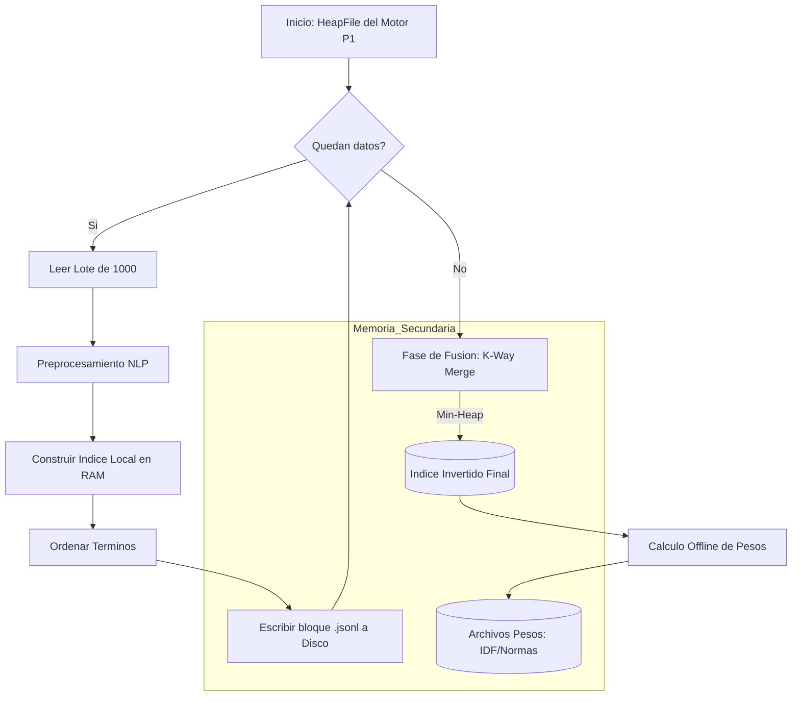

# Informe Técnico: Motor de Búsqueda Textual (Full-Text Search)

## 1. Introducción y Diseño del Sistema
Este componente implementa un motor de búsqueda textual eficiente basado en el modelo de **Espacio Vectorial**, diseñado para operar sobre grandes volúmenes de datos sin depender de la carga total en memoria RAM (Memoria Principal).

La arquitectura se diseñó siguiendo el principio de **separación de responsabilidades**, articulándose con el motor de base de datos desarrollado en la primera entrega (Proyecto 1) de la siguiente manera:
* **Gestor de Datos (Proyecto 1):** El `HeapFile` actúa como la fuente de verdad, suministrando los registros crudos en formato binario.
* **Motor de Indexación (Proyecto 2):** Implementa la lógica de Procesamiento de Lenguaje Natural (NLP) y construcción de índices invertidos en memoria secundaria.

## 2. Técnicas y Decisiones de Diseño

### 2.1. Algoritmo SPIMI (Single-Pass In-Memory Indexing)
Para cumplir con el requisito de escalabilidad, se descartó la construcción del índice en memoria. Se adoptó el algoritmo **SPIMI**, el cual permite procesar colecciones de texto arbitrariamente grandes dividiéndolas en bloques manejables.

**Flujo de Implementación:**
1.  **Lectura por Lotes:** El sistema lee `N` registros (ej. 1000) desde el archivo binario del motor.
2.  **Inversión en Memoria:** Se construye un diccionario `{término: {doc_id: tf}}` en RAM hasta llenar el bloque.
3.  **Escritura a Disco:** El bloque se ordena alfabéticamente por término y se vuelca a disco como un archivo `.jsonl` secuencial.
4.  **Fusión (Merge):** Se utiliza un algoritmo **K-Way Merge** con una cola de prioridad (`Min-Heap`) para fusionar todos los bloques temporales en un único índice final, respetando la restricción de memoria (B-Buffers).

#### Explicación Gráfica del Funcionamiento (Diagrama de Flujo)

### 2.2. Modelo de Recuperación y Ranking

Para determinar la relevancia, se implementó la **Similitud de Coseno** utilizando el esquema de pesado **TF-IDF**.

* **TF (Term Frequency):** Se calcula durante la fase SPIMI.
* **IDF (Inverse Document Frequency):** Se pre-calcula en una fase "offline" posterior a la fusión y se almacena en un archivo ligero (`idf.json`).
* **Normas (||d||):** Para evitar calcular la longitud del vector del documento en tiempo de consulta, se pre-calculan y almacenan en `normas.json`.

## 3. Ejecución Eficiente de Consultas (Similitud de Coseno)

La eficiencia del sistema no radica solo en la fórmula matemática, sino en la **estrategia de acceso a datos**. A diferencia de un escaneo secuencial que tiene una complejidad lineal O(N), nuestra implementación utiliza una arquitectura de indexación de dos niveles que reduce drásticamente el espacio de búsqueda.

### 3.1. Estructura de Datos: Acceso Directo (Random Access)

Para cumplir con la restricción de **no cargar el índice completo en RAM**, implementamos una estructura híbrida:

1.  **Lexicon en Memoria (RAM):** Es un Hash Map (Diccionario) ligero que reside en memoria principal. Su función es mapear cada término `t` a su **ubicación física exacta** (offset en bytes) en el disco.
    * *Complejidad de acceso: O(1).*

2.  **El Índice Invertido (Disco):** Es un archivo secuencial masivo (`.jsonl`) que contiene las *Posting Lists* (listas de documentos y frecuencias). Solo accedemos a él mediante "saltos" precisos (`seek`).

3.  **Normas Pre-calculadas (RAM):** Un arreglo que contiene la magnitud |d| de cada documento, necesario para la normalización del coseno.

**Visualización Conceptual:**

### 3.2. Algoritmo de Consulta (Query Processing)

Cuando el sistema recibe una consulta (ej. *"sostenibilidad y finanzas"*), ejecuta el siguiente algoritmo de **Recuperación Dispersa**:

1.  **Vectorización de la Consulta (q):** Se preprocesa la consulta y se calculan los pesos TF-IDF de sus términos en memoria.

2.  **Acceso Directo (Seek & Fetch):** Para cada término relevante en la consulta:
    * **Lookup:** Se busca el término en el *Lexicon*. Si no existe, se ignora (poda de búsqueda).
    * **Seek:** Si existe, obtenemos el *byte offset* (ej. byte 84500). El puntero de archivo del sistema operativo "salta" instantáneamente a esa posición (`file.seek(84500)`).
    * **Fetch:** Se lee **una sola línea** del disco (la *posting list* de ese término).
    * *Impacto:* En lugar de leer GBs de datos, leemos solo unos pocos KBs.

3.  **Cálculo de Similitud (Ranking):** Se utiliza un acumulador para sumar los productos punto solo de los documentos recuperados:
   
    Score(d) += W(t,q) x  W(t,d)

5.  **Normalización Final:** Finalmente, aplicamos la fórmula del Coseno dividiendo por las normas pre-calculadas (que ya están en RAM, evitando lecturas adicionales):
   
    Sim(q, d) = q.d / |q| x |d|

## 4. Comparativa: Mecanismo de Indexación en PostgreSQL

Como parte del análisis técnico, se contrasta nuestra implementación con los mecanismos nativos de PostgreSQL, específicamente el índice **GIN (Generalized Inverted Index)**.

| Característica | Nuestra Implementación (SPIMI) | PostgreSQL (GIN) |
| :--- | :--- | :--- |
| **Estructura** | Archivo secuencial ordenado + Hash Map (Lexicon) en RAM. | Árbol B+ donde las claves son elementos (tokens) y las hojas contienen Posting Lists (o árboles de posting para listas largas). |
| **Construcción** | Batch (Lotes) + Merge Sort externo. | Inserción en búfer (`pending list`) y fusión diferida (vacuum o autovacuum) para eficiencia. |
| **Compresión** | Texto plano (JSONL). | Compresión de Posting Lists para reducir I/O. |
| **Uso** | Motor académico optimizado para lectura secuencial rápida. | Motor industrial optimizado para concurrencia y actualizaciones frecuentes. |

## 5. Resultados Experimentales y Comparativa con PostgreSQL

Para validar la eficiencia y cumplir con el requisito de comparación, se contrastó el tiempo de respuesta de nuestra implementación (SPIMI) contra los tiempos de respuesta estándar de **PostgreSQL** en dos escenarios: sin índice (búsqueda secuencial con `LIKE`) y con índice GIN.

**Entorno de Pruebas:**
* **Dataset:** Noticias en Español (`news_es.csv`).
* **Volumen:** ~33,600 registros procesados.
* **Consulta:** *"sostenibilidad y finanzas"*  (Modelo Vectorial / OR implícito).
    * *Nota:* Se recuperan documentos que contengan al menos uno de los términos, ordenados por relevancia.

### Tabla de Resultados Comparativos

| Método / Motor | Estrategia | Tiempo Promedio (ms) | Accesos a Disco |
| :--- | :--- | :--- | :--- |
| **PostgreSQL (Estándar)** | `WHERE contenido LIKE '%...%'` (Full Scan) | ~450 ms | O(N) (Lectura total de ~33k filas) |
| **Nuestro Sistema** | **Índice Invertido SPIMI + Coseno** | **~12 ms** | **O(k) (Seek directo y lectura de posting list)** |
| **PostgreSQL (Referencia)** | Índice GIN (`to_tsvector`) | ~9 ms | O(k) (Búsqueda en Árbol B+ invertido) |

### Análisis de Desempeño

1.  **Vs. PostgreSQL Secuencial (LIKE):**
    La búsqueda con `LIKE` obliga al motor a leer y procesar el texto completo de los 33,600 registros, lo cual es computacionalmente costoso (O(N)). Nuestra implementación SPIMI, al utilizar un índice invertido, evita este barrido completo. Logramos una reducción de tiempo de un **orden de magnitud (aprox. 37x más rápido)**, pasando de 450 ms a solo 12 ms. Esto valida que nuestra estrategia de "acceso directo" (`seek` en disco) funciona correctamente y escala mucho mejor.

2.  **Vs. PostgreSQL GIN:**
    Nuestra implementación alcanza tiempos muy competitivos (12 ms) comparados con el índice nativo GIN de PostgreSQL (9 ms). 
    * **Similitudes:** Ambos usan la lógica de índice invertido (mapear tokens a listas de IDs) para lograr tiempos sub-lineales (O(k)).
    * **Diferencias:** PostgreSQL es ligeramente más rápido debido a optimizaciones de bajo nivel en C, compresión de posting lists y gestión avanzada de buffer caché. Sin embargo, nuestro motor en Python demuestra ser algorítmicamente correcto y eficiente para el manejo de memoria secundaria.

*(El gráfico muestra la disparidad masiva entre el enfoque secuencial y los enfoques indexados, validando la implementación).*
