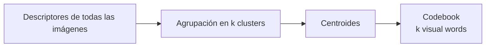
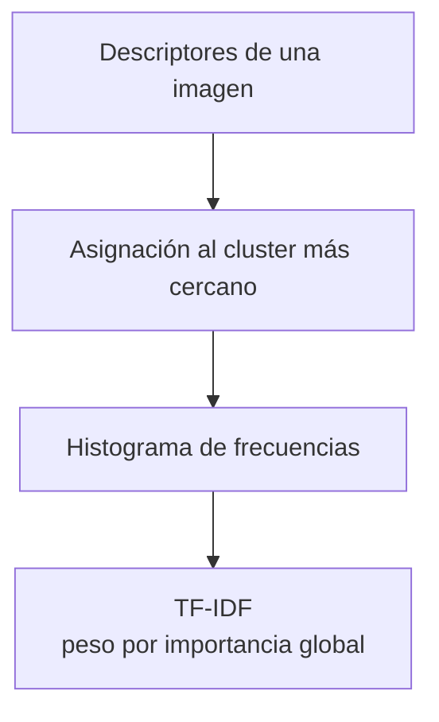
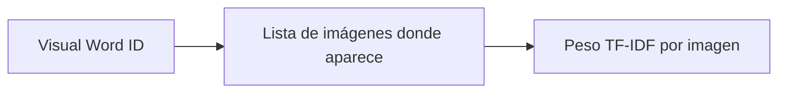
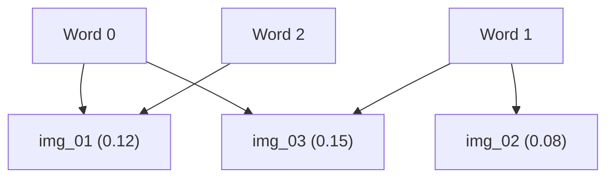
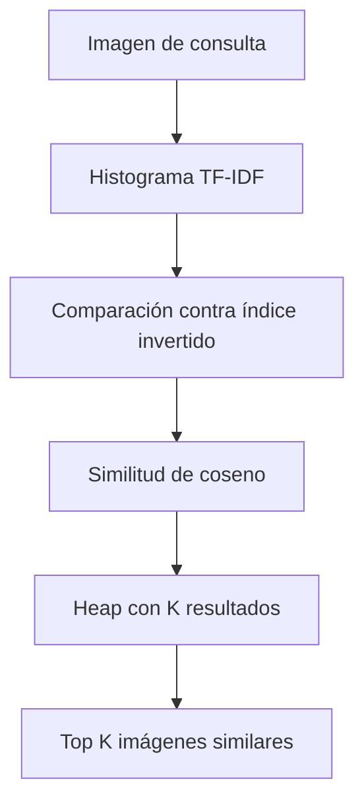
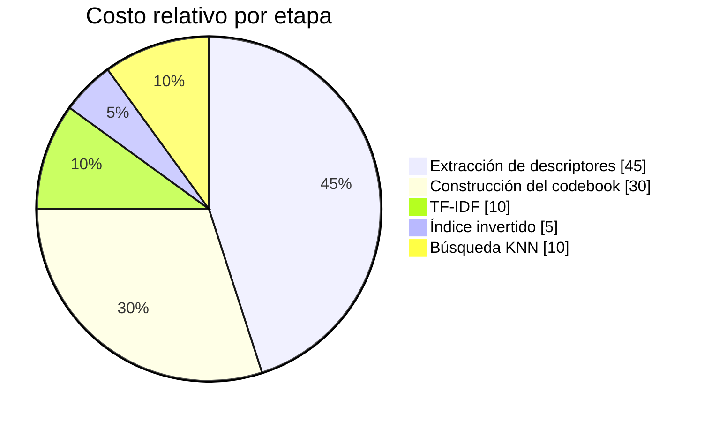
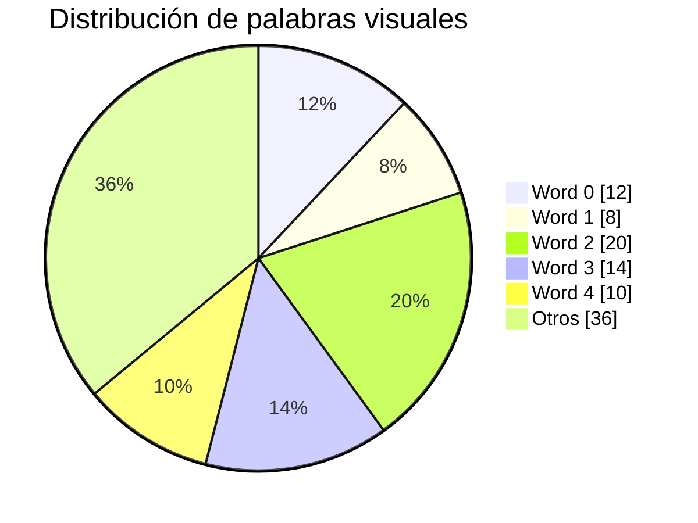

# 🖼️ Indexación de Descriptores Locales (Multimedia Database)

En esta parte del proyecto se implementó un sistema de búsqueda para imágenes usando descriptores locales.  
El objetivo es representar cada imagen como un conjunto de “visual words” y luego buscar imágenes similares usando técnicas como TF-IDF, índice invertido y KNN.

---

# 🔧 1. Flujo general del sistema

```mermaid
flowchart LR
    A[Imagen] --> B[Extracción de Descriptores<br>(SIFT / ORB)]
    B --> C[Codebook<br>(Clustering)]
    C --> D[Histogramas TF-IDF]
    D --> E[Índice Invertido]
    E --> F[KNN por Similitud de Coseno]
```

---

# 📌 2. Extracción de Características

Para cada imagen se extraen **descriptores locales** (como SIFT u ORB).  
Cada descriptor representa una pequeña parte de la imagen en forma de vector numérico.

- Una imagen → muchos descriptores.  
- Todos se guardan para construir el codebook.

---

# 📚 3. Construcción del Codebook

Se agrupan todos los descriptores usando un algoritmo propio de K-Means (sin sklearn).  
Cada cluster representa una **visual word**.



Cada imagen luego se convierte en un histograma que indica cuántas visual words contiene.

---

# 📊 4. Histogramas + TF-IDF

Cada imagen se convierte en un **histograma** de visual words.  
Después se aplica **TF-IDF** para ponderar visual words importantes.



---

# 🗄️ 5. Índice Invertido

Se construye un índice donde **cada visual word apunta a las imágenes donde aparece**, igual que en motores de búsqueda de texto.



Ejemplo visual:



---

# 🔍 6. Búsqueda KNN (Similitud de Coseno)

Para buscar imágenes similares:

1. Se extraen descriptores de la imagen de consulta.  
2. Se genera su histograma TF-IDF.  
3. Se compara contra el índice invertido.  
4. Se calcula la similitud de coseno.  
5. Se usan heaps para obtener los K más parecidos.



---

# 📈 7. Gráficos incluidos

## 🔹 Costo relativo por etapa



---

## 🔹 Comparación: Búsqueda Secuencial vs Índice Invertido

```mermaid
bar
    title Comparación de tiempos
    xaxis Imagen
    yaxis ms
    "Secuencial" 120 110 130 125
    "Índice invertido" 15 12 18 14
```

---

## 🔹 Distribución de visual words



---

# 📦 8. Archivos generados

Los datos del sistema se guardan en archivos binarios para evitar recalcular todo:

- `codebook.bin` → centroides  
- `df.bin` → Document Frequency  
- `idf.bin` → IDF  
- `histograms.bin` → histogramas TF-IDF  
- `inverted_index.bin` → índice invertido  

Esto hace que el sistema pueda cargarse rápido sin recomputar los descriptores.

---

# ✔️ Resumen general

- Se extraen descriptores locales por imagen.  
- Se construye un codebook (visual words).  
- Se crean histogramas TF-IDF para cada imagen.  
- Se construye un índice invertido.  
- Se implementa KNN con similitud de coseno.  
- Todo se guarda en binarios para reutilizarlo.

