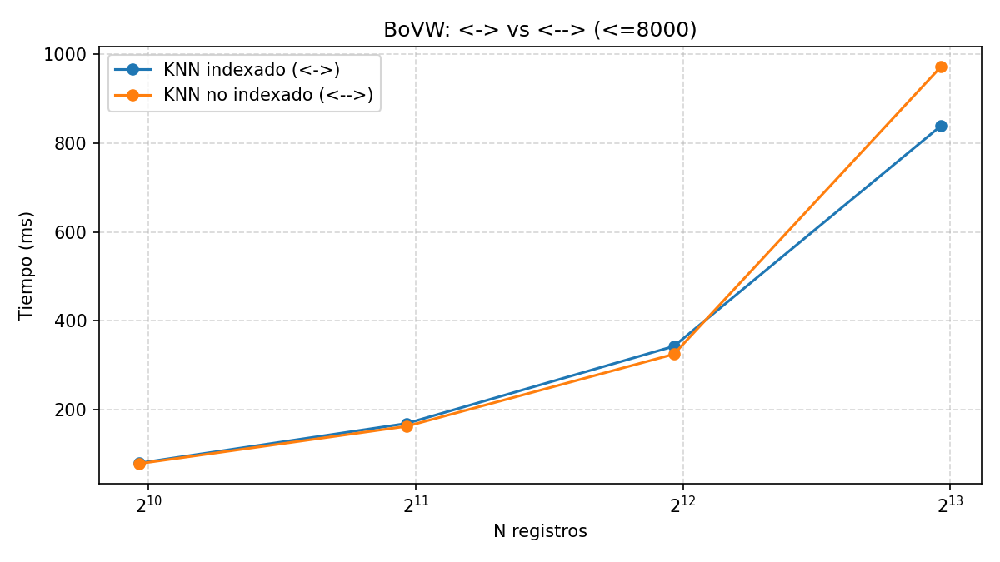
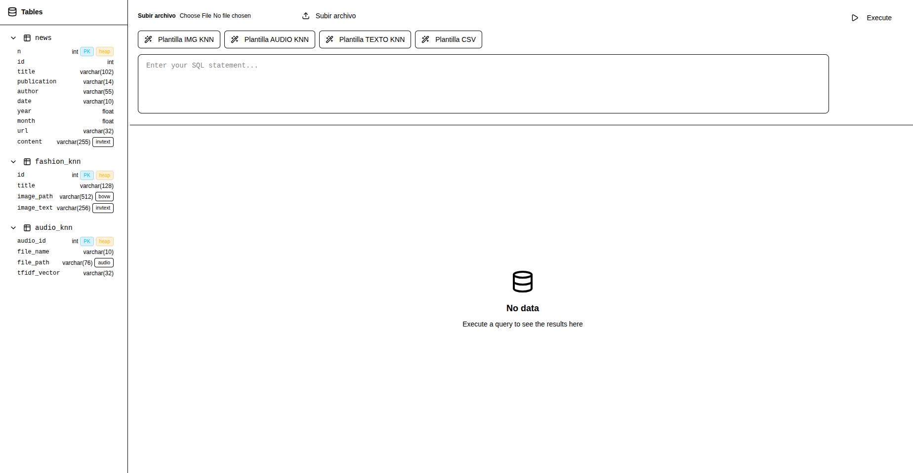
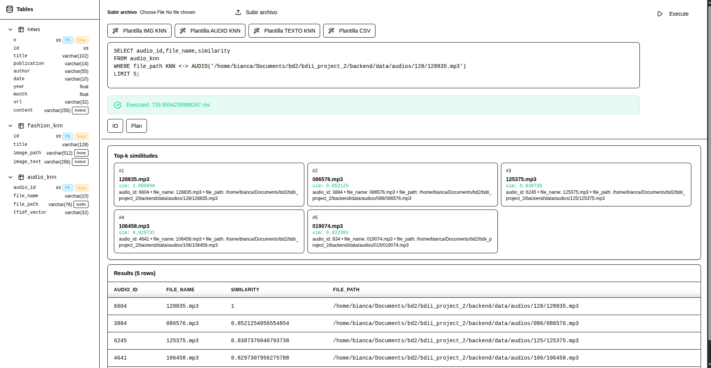
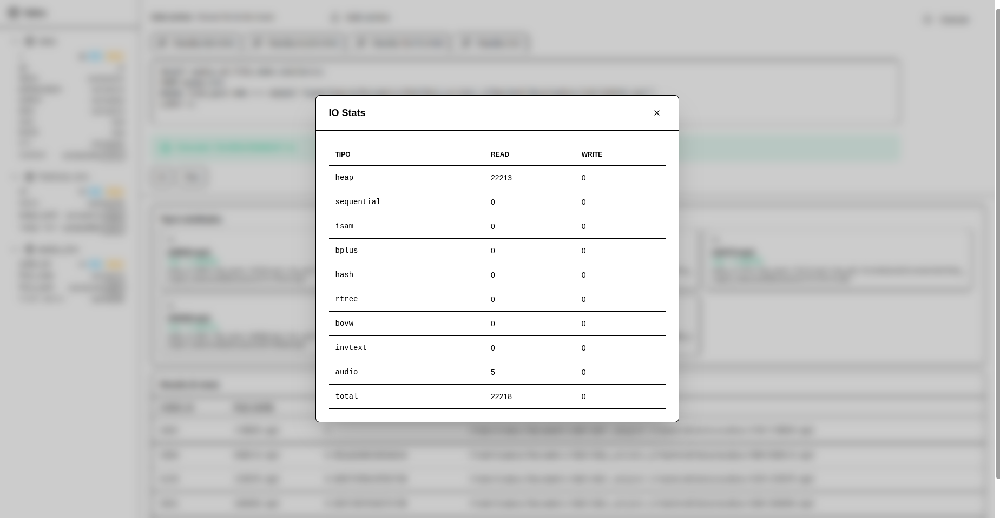
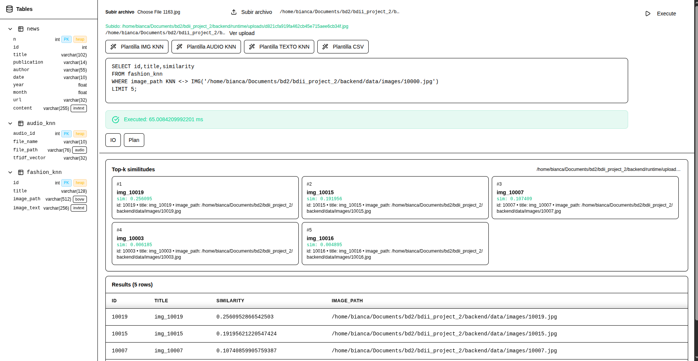
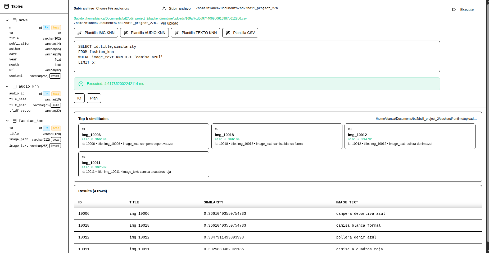
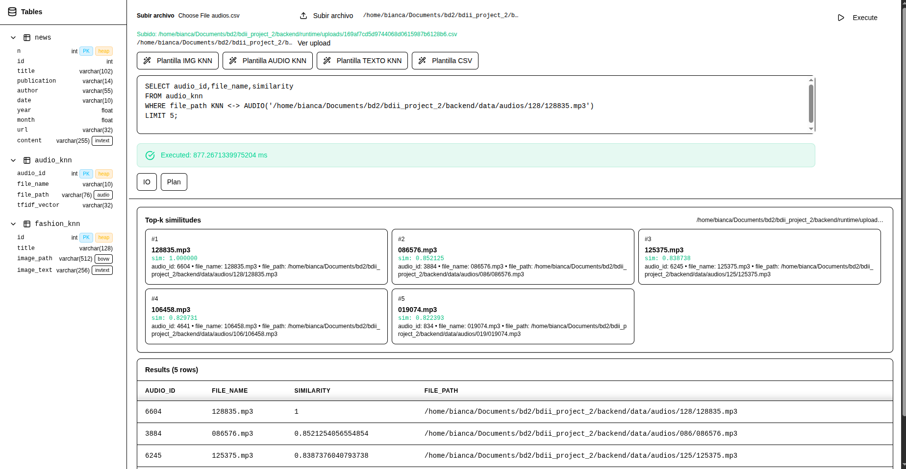

### Benchmark BoVW (≤ 8 000 imágenes)

#### Resultados

Tabla de tiempos de consulta (mediana en ms) para distintos tamaños de colección:

| # Imágenes | Indexado (KNN sobre índice) | Secuencial (KNN sin índice) |
|-----------:|----------------------------:|-----------------------------:|
| 1 000      | 80.08                       | 78.82                        |
| 2 000      | 169.09                      | 162.72                       |
| 4 000      | 342.72                      | 324.91                       |
| 8 000      | 839.06                      | 972.07                       |



En el gráfico ambos métodos se representan sobre escala logarítmica en el eje X (tamaño de la colección), lo que permite observar la tendencia casi lineal del crecimiento de los tiempos con respecto al número de imágenes.


#### Análisis y discusión

- **Colecciones pequeñas (1k–4k)**  
  - Los tiempos de consulta del método indexado y del método secuencial son **muy similares**.
  - En este rango, el **overhead de mantenimiento y acceso al índice** compensa (o incluso supera ligeramente) la ganancia respecto a leer la colección de forma lineal.

- **Colección mediana (8k)**  
  - A partir de 8 000 imágenes, el método **indexado pasa a ser claramente más eficiente**:
    - Indexado: 839.06 ms  
    - Secuencial: 972.07 ms  
  - Esto indica que, a medida que crece la colección, el índice invertido **reduce el costo efectivo por consulta** frente a recorrer toda la colección.

- **Escalamiento con N**
  - Ambos métodos muestran un crecimiento de tiempo **aproximadamente lineal con el número de imágenes**, consistente con:
    - Búsqueda secuencial: coste proporcional a `O(N)`.
    - Búsqueda indexada: coste dominado por:
      - Acceso al índice (coste sublineal / casi constante para la parte de filtrado).
      - Costo de refinar candidatos, que sigue creciendo con `N`, pero **más lento que un escaneo completo**.

- **Conclusión parcial (≤ 8k)**  
  - En tamaños pequeños, la diferencia entre usar índice y no usarlo es casi **neutra**.
  - A partir de algunos miles de imágenes (en este experimento, alrededor de **8k**), el uso de índice invertido comienza a **mostrar beneficios claros en tiempo de respuesta**, lo que justifica su uso para colecciones de imágenes medianas/grandes.


### Presentación: Uso y Pruebas

Se revisará el frontend de la aplicación. La interfaz se ve como en la siguiente imagen:



En la parte izquierda se muestran las tablas creadas con sus atributos e índices. Se deja un espacio para escribir sentencias SQL y un botón para ejecutarlas, además de una sección de carga de archivos (csv, imágenes y audios). Debajo se muestra la data, y cada vez que se ejecuta una operación se muestra la información de escritura y lectura, además del planificador, como se ve en la siguiente imagen:





#### Definición de sentencias

Creación de tablas e índices

```sql
CREATE TABLE <tabla>(
  <pk> INT PRIMARY KEY USING heap,
  <col_1> VARCHAR(...),
  <col_2> VARCHAR(...),
  ... -- incluye image_path / file_path / content, etc.
);

-- Importar desde CSV (ruta absoluta o accesible)
CREATE TABLE <tabla> FROM FILE '<ruta_al_csv>';

-- Imágenes
CREATE INDEX ON <tabla>(<image_path>) USING bovw;

-- Audio
CREATE INDEX ON <tabla>(<file_path>) USING audio;

-- Texto
CREATE INDEX ON <tabla>(<content>) USING invtext;
```

KNN Indexado

```sql
-- Imagen
SELECT <pk>, <col_ruta>, similarity
FROM <tabla>
WHERE <col_ruta> KNN <-> IMG('<ruta/archivo.ext>')
LIMIT k;

-- Audio
SELECT <pk>, <col_ruta>, similarity
FROM <tabla>
WHERE <col_ruta> KNN <-> AUDIO('<ruta/archivo.ext>')
LIMIT k;

-- Texto
SELECT <pk>, <col_texto>, similarity
FROM <tabla>
WHERE <col_texto> KNN <-> 'consulta'
LIMIT k;
```

KNN No Indexado

```sql
-- Imagen
SELECT <pk>, <col_ruta>, similarity
FROM <tabla>
WHERE <col_ruta> KNN <--> IMG('<ruta/archivo.ext>')
LIMIT k;

-- Audio
SELECT <pk>, <col_ruta>, similarity
FROM <tabla>
WHERE <col_ruta> KNN <--> AUDIO('<ruta/archivo.ext>')
LIMIT k;
```

##### Casos de uso

###### Caso 1

```sql
CREATE TABLE fashion_knn(
  id INT PRIMARY KEY USING heap,
  title VARCHAR(128),
  image_path VARCHAR(512),
  image_text VARCHAR(256)
);

INSERT INTO fashion_knn(id,title,image_path,image_text) VALUES
 (10003,'img_10003','/home/bianca/Documents/bd2/bdii_project_2/backend/data/fashion-dataset/images/10003.jpg','remera negra basica'),
 (10004,'img_10004','/home/bianca/Documents/bd2/bdii_project_2/backend/data/fashion-dataset/images/10004.jpg','reloj plateado mujer'),
 (10005,'img_10005','/home/bianca/Documents/bd2/bdii_project_2/backend/data/fashion-dataset/images/10005.jpg','zapatos negros elegantes'),
 (10006,'img_10006','/home/bianca/Documents/bd2/bdii_project_2/backend/data/fashion-dataset/images/10006.jpg','campera deportiva azul'),
 (10007,'img_10007','/home/bianca/Documents/bd2/bdii_project_2/backend/data/fashion-dataset/images/10007.jpg','jeans slim fit azules'),
 (10008,'img_10008','/home/bianca/Documents/bd2/bdii_project_2/backend/data/fashion-dataset/images/10008.jpg','blusa blanca manga larga'),
 (10009,'img_10009','/home/bianca/Documents/bd2/bdii_project_2/backend/data/fashion-dataset/images/10009.jpg','pantalón gris casual'),
 (10010,'img_10010','/home/bianca/Documents/bd2/bdii_project_2/backend/data/fashion-dataset/images/10010.jpg','chaqueta cuero negra'),
 (10011,'img_10011','/home/bianca/Documents/bd2/bdii_project_2/backend/data/fashion-dataset/images/10011.jpg','camisa a cuadros roja'),
 (10012,'img_10012','/home/bianca/Documents/bd2/bdii_project_2/backend/data/fashion-dataset/images/10012.jpg','pollera denim azul'),
 (10013,'img_10013','/home/bianca/Documents/bd2/bdii_project_2/backend/data/fashion-dataset/images/10013.jpg','zapatillas running gris'),
 (10014,'img_10014','/home/bianca/Documents/bd2/bdii_project_2/backend/data/fashion-dataset/images/10014.jpg','abrigo invierno beige'),
 (10015,'img_10015','/home/bianca/Documents/bd2/bdii_project_2/backend/data/fashion-dataset/images/10015.jpg','buzo hoodie negro'),
 (10016,'img_10016','/home/bianca/Documents/bd2/bdii_project_2/backend/data/fashion-dataset/images/10016.jpg','vestido estampado floral'),
 (10017,'img_10017','/home/bianca/Documents/bd2/bdii_project_2/backend/data/fashion-dataset/images/10017.jpg','shorts jeans celeste'),
 (10018,'img_10018','/home/bianca/Documents/bd2/bdii_project_2/backend/data/fashion-dataset/images/10018.jpg','camisa blanca formal'),
 (10019,'img_10019','/home/bianca/Documents/bd2/bdii_project_2/backend/data/fashion-dataset/images/10019.jpg','camiseta deportiva roja'),
 (10020,'img_10020','/home/bianca/Documents/bd2/bdii_project_2/backend/data/fashion-dataset/images/10020.jpg','falda negra plisada');

CREATE INDEX ON fashion_knn(image_path)  USING bovw;
CREATE INDEX ON fashion_knn(image_text) USING invtext;

SELECT id,title,similarity
FROM fashion_knn
WHERE image_path KNN <-> IMG('/home/bianca/Documents/bd2/bdii_project_2/backend/data/images/10000.jpg')
LIMIT 5;

SELECT id,title,similarity
FROM fashion_knn
WHERE image_text KNN <-> 'camisa azul'
LIMIT 5;
```






##### Caso 2

```sql
CREATE TABLE audio_knn FROM '/home/bianca/Documents/bd2/bdii_project_2/backend/runtime/uploads/169af7cd5d9744068d0615987b6128b6.csv';

CREATE INDEX ON audio_knn(file_path) USING audio;

SELECT audio_id,file_name,similarity
FROM audio_knn
WHERE file_path KNN <-> AUDIO('/home/bianca/Documents/bd2/bdii_project_2/backend/data/audios/128/128835.mp3')
LIMIT 5;

```



#### Video Demo

[Demo](https://drive.google.com/file/d/1nQqim1CEIuLGPpTBhms0WiWudbgFRThC/view?usp=drive_link)


### Instrucciones de uso

Crear carpeta data dentro de backend y subir imágenes en carpeta nueva carpeta images y audios en una nueva carpeta audios.

Para poder crear los csv correr el archivo `generate_media_csvs.py` que se encuentra en la carpeta `scripts`.

Tras ello, realizar la carga de datos por csv desde la interfaz gráfica.

Utilizar los siguientes comandos para correr el proyecto:

Backend: desde la raíz del proyecto:

```
uvicorn backend.main:app --reload
```

Frontend: desde la carpeta frontend\

```
npm i
npm run dev
```