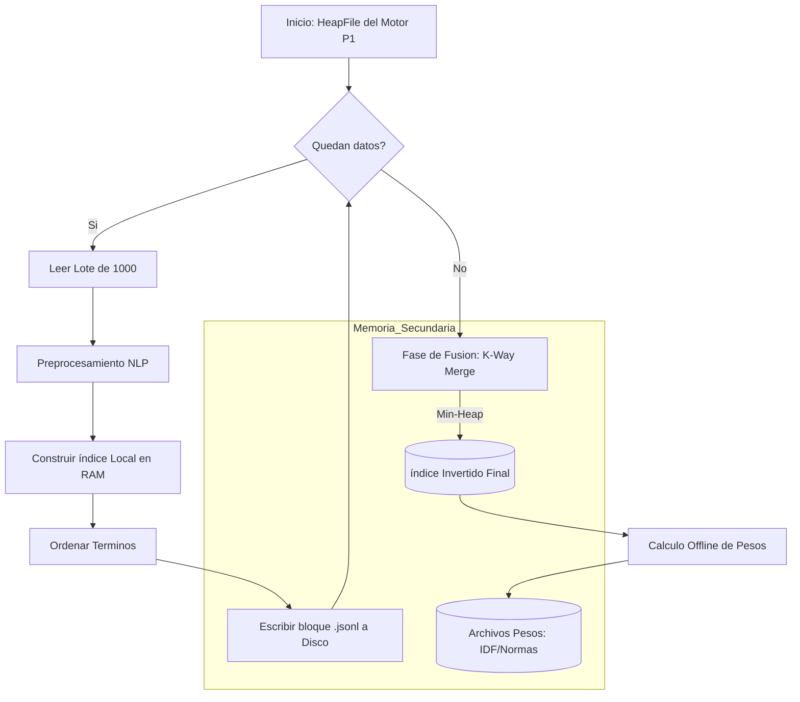
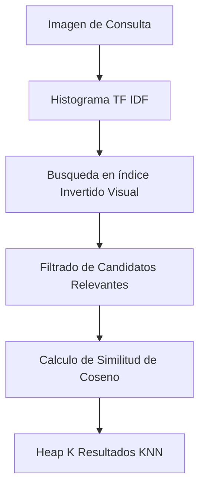

# Proyecto 2 BDII

Sistema de base de datos relacional con aplicación de índices, con enfoque en texto, imagenes y audio.

## Ejecutar el Proyecto

Por defecto usamos Docker para aislar dependencias y evitar problemas de versiones. Ejecute

```bash
make
```

Esto construirá las imágenes y levantará ambos servicios:

- **Backend**: `http://127.0.0.1:8000`
- **Frontend**: `http://localhost:5173`

# Introducción

Hoy en día, al considerar almacenamiento y bases de datos, vamos directamente al modelo relacional y al manejo de SQL. Aunque resulta muy potente y optimizado para la inserción, búsqueda, eliminación de actualización de datos tabulares, sobre todo con el manejo de índices, este resulta no muy bueno, o incluso obsoleto, al enfrentarse a datos semiestructurados o no estructurados. Este tipo de datos en los últimos años han cobrado una verdadera importancia con el despertar de áreas como el Big Data, y por tanto hay la necesidad de ajustar este modelo relacional para soportar esta data. Un poco con ello, es que este proyecto propone una base de datos unificada, que provee un manejo de datos e índice clásicos (tabulares), obtenidos de una implementación anterior, pero también el manejo de textos, imágenes y audios como parte de datos semiestructurados y no estructurados, y siendo el foco de esta implementación.

## Dominio de datos

Como se detallo anteriormente, el dominio de datos enfocado en esta implementación son textos, imágenes y audios, siendo claros ejemplos de data que escapa este formato clásico tabular o relacional, y que brinda problemas a los gestores clásicos utilizados como Oracle o PostgreSQL. Un poco para hacer un acercamiento y descripción veremos cada uno:

- **Texto:** Se han tomado descripciones de productos y noticias extraídas de archivos separados por comas (csv), como por ejemplo *large_news.csv*, donde se tiene información básica de cada registro pero finalmente con un texto largo que describe dicho registro. El reto aquí es poder finalmente hacer búsquedas por el contenido de este texto en mención.

- **Imagen:** Se toman imágenes variadas a color de diferentes resoluciones y tamaños; con contenidos y colores distintos. El reto aquí es poder usar una imagen cualquiera y obtener las más parecidas. 

- **Audio:** Se toman audios variados de diferente duración, tono, volumen; en sí con características distintas y variadas para validar la implementación. El reto aquí es poder usar un audio cualquiera y obtener los más parecidos.

Para ver el dominio de datos que se maneja, revise los enlaces en el apéndice, ubicado en la sección final.

## Justificación

La cuestión se resume: ¿por qué la necesidad de esta implementación? Actualmente existen un montón de productos y servicios que soportan el almacenamiento de datos semiestructurados y no estructurados, y además de poder hacer operaciones sobre estos. Un poco ello se refleja con la aparición del NoSQL, como un escape a este modelo tabular o relacional. Lo que se pretende es brindar una unificación de datos estructurados y no estructurados, y adaptarlas al modelo relacional que utiliza SQL, haciendo su uso mucho más usual y normal para el usuario común. También, dada toda la información y los datos que se manejan actualmente, recuperar la data mediante contenido resulta fundamental por su utilidad. Los usuarios quiere consultar, saber parecidos, y dado a ello tomar decisiones, y es lo que nosotros brindamos.

## Funcionamiento esperado

Enfocándonos en los datos semiestructurados y no estructurados, esta implementación busca permitir su almacenamiento, consulta y procesamiento de manera unificada. En la siguiente imagen se muestra, de forma general, cómo se espera que funcione este sistema.


# Índice Invertido: Texto

## Construcción del Índice: Motor de Búsqueda Textual

### Introducción y Diseño del Sistema
---
Este componente implementa un motor de búsqueda textual eficiente basado en el modelo de **Espacio Vectorial**, diseñado para operar sobre grandes volúmenes de datos sin depender de la carga total en memoria RAM (Memoria Principal).

La arquitectura se diseñó siguiendo el principio de **separación de responsabilidades**, articulándose con el motor de base de datos desarrollado en la primera entrega (Proyecto 1) de la siguiente manera:
* **Gestor de Datos (Proyecto 1):** El `HeapFile` actúa como la fuente de verdad, suministrando los registros crudos en formato binario.
* **Motor de Indexación (Proyecto 2):** Implementa la lógica de Procesamiento de Lenguaje Natural (NLP) y construcción de índices invertidos en memoria secundaria.

### Técnicas y Decisiones de Diseño
---
#### Algoritmo SPIMI (Single-Pass In-Memory Indexing)
Para cumplir con el requisito de escalabilidad, se descartó la construcción del índice en memoria. Se adoptó el algoritmo **SPIMI**, el cual permite procesar colecciones de texto arbitrariamente grandes dividiéndolas en bloques manejables.

**Flujo de Implementación:**
1.  **Lectura por Lotes:** El sistema lee `N` registros (ej. 1000) desde el archivo binario del motor.
2.  **Inversión en Memoria:** Se construye un diccionario `{término: {doc_id: tf}}` en RAM hasta llenar el bloque.
3.  **Escritura a Disco:** El bloque se ordena alfabéticamente por término y se vuelca a disco como un archivo `.jsonl` secuencial.
4.  **Fusión (Merge):** Se utiliza un algoritmo **K-Way Merge** con una cola de prioridad (`Min-Heap`) para fusionar todos los bloques temporales en un único índice final, respetando la restricción de memoria (B-Buffers).

#### Explicación Gráfica del Funcionamiento (Diagrama de Flujo)



#### Modelo de Recuperación y Ranking

Para determinar la relevancia, se implementó la **Similitud de Coseno** utilizando el esquema de pesado **TF-IDF**.

* **TF (Term Frequency):** Se calcula durante la fase SPIMI.
* **IDF (Inverse Document Frequency):** Se pre-calcula en una fase "offline" posterior a la fusión y se almacena en un archivo ligero (`idf.json`).
* **Normas (||d||):** Para evitar calcular la longitud del vector del documento en tiempo de consulta, se pre-calculan y almacenan en `normas.json`.

## Ejecución Eficiente de Consultas (Similitud de Coseno)

La eficiencia del sistema no radica solo en la fórmula matemática, sino en la **estrategia de acceso a datos**. A diferencia de un escaneo secuencial que tiene una complejidad lineal O(N), nuestra implementación utiliza una arquitectura de indexación de dos niveles que reduce drásticamente el espacio de búsqueda.

### Estructura de Datos: Acceso Directo (Random Access)
---
Para cumplir con la restricción de **no cargar el índice completo en RAM**, implementamos una estructura híbrida:

1.  **Lexicon en Memoria (RAM):** Es un Hash Map (Diccionario) ligero que reside en memoria principal. Su función es mapear cada término `t` a su **ubicación física exacta** (offset en bytes) en el disco.
    * *Complejidad de acceso: O(1).*

2.  **El Índice Invertido (Disco):** Es un archivo secuencial masivo (`.jsonl`) que contiene las *Posting Lists* (listas de documentos y frecuencias). Solo accedemos a él mediante "saltos" precisos (`seek`).

3.  **Normas Pre-calculadas (RAM):** Un arreglo que contiene la magnitud |d| de cada documento, necesario para la normalización del coseno.

**Visualización Conceptual:**

### Algoritmo de Consulta (Query Processing)
---
Cuando el sistema recibe una consulta (ej. *"sostenibilidad y finanzas"*), ejecuta el siguiente algoritmo de **Recuperación Dispersa**:

1.  **Vectorización de la Consulta (q):** Se preprocesa la consulta y se calculan los pesos TF-IDF de sus términos en memoria.

2.  **Acceso Directo (Seek & Fetch):** Para cada término relevante en la consulta:
    * **Lookup:** Se busca el término en el *Lexicon*. Si no existe, se ignora (poda de búsqueda).
    * **Seek:** Si existe, obtenemos el *byte offset* (ej. byte 84500). El puntero de archivo del sistema operativo "salta" instantáneamente a esa posición (`file.seek(84500)`).
    * **Fetch:** Se lee **una sola línea** del disco (la *posting list* de ese término).
    * *Impacto:* En lugar de leer GBs de datos, leemos solo unos pocos KBs.

3.  **Cálculo de Similitud (Ranking):** Se utiliza un acumulador para sumar los productos punto solo de los documentos recuperados:
   
    Score(d) += W(t,q) x  W(t,d)

5.  **Normalización Final:** Finalmente, aplicamos la fórmula del Coseno dividiendo por las normas pre-calculadas (que ya están en RAM, evitando lecturas adicionales):
   
    Sim(q, d) = q.d / |q| x |d|

## Mecanismo de Indexación en PostgreSQL

Como parte del análisis técnico, se contrasta nuestra implementación con los mecanismos nativos de PostgreSQL, específicamente el índice **GIN (Generalized Inverted Index)**.

| Característica | Nuestra Implementación (SPIMI) | PostgreSQL (GIN) |
| :--- | :--- | :--- |
| **Estructura** | Archivo secuencial ordenado + Hash Map (Lexicon) en RAM. | Árbol B+ donde las claves son elementos (tokens) y las hojas contienen Posting Lists (o árboles de posting para listas largas). |
| **Construcción** | Batch (Lotes) + Merge Sort externo. | Inserción en búfer (`pending list`) y fusión diferida (vacuum o autovacuum) para eficiencia. |
| **Compresión** | Texto plano (JSONL). | Compresión de Posting Lists para reducir I/O. |
| **Uso** | Motor académico optimizado para lectura secuencial rápida. | Motor industrial optimizado para concurrencia y actualizaciones frecuentes. |

## Overview: Flujo en la implementación

A manera de **overview**, presentamos un resumen del flujo de las dos operaciones principales en la implementación:  
1. **Creación del índice invertido textual**  
2. **Proceso de consulta**

En ambos casos, la **data real de los textos está almacenada en un archivo heap**.  
Este archivo se utiliza tanto para alimentar la creación del índice como para recuperar la información solicitada durante las consultas.  
A continuación, se explica cada proceso.

---

### Creación de índice

La data real de los textos se encuentra en un **heapfile**.  
El proceso consiste en:

1. **Calcular cuántos registros pueden cargarse en RAM simultáneamente.**  
2. Leer los registros en **bloques** desde el heapfile.
3. El **primer bloque** se utiliza para crear el índice invertido textual mediante  
   `createInvertedIndex(...)`, que recibe una lista de registros.
4. Los **bloques siguientes** se incorporan al índice mediante  
   `addInvertedIndex(...)`, que también recibe una lista de registros.
5. Durante este proceso se guarda, junto a cada registro (doc), su  
   **posición física en el heapfile**, necesaria para la posterior recuperación de información.

El flujo general se muestra en la siguiente imagen:


---

### Consultas y búsqueda

Cuando se recibe una consulta:

1. El **índice invertido textual** procesa la query y retorna una **lista ordenada de posiciones físicas**.  
   - Cada posición corresponde a un registro en el heapfile.  
   - El orden ya refleja el **ranking de relevancia** para la consulta.

2. Para cada posición física, se realiza un **random access** al heapfile.  
3. Los registros obtenidos se agregan en una lista final.  
4. Se retorna al usuario el resultado ordenado.

El flujo se ilustra en la siguiente imagen:


# Índice Invertido: Imagenes

## Construcción del Bag of Visual Words

Primero se extraen descriptores locales (SIFT u ORB) de cada imagen.  
Todos los descriptores del dataset se combinan en una sola matriz y se aplica un algoritmo K-Means implementado manualmente.  
Cada cluster generado representa un *visual word*, y los centroides forman el **codebook**.  

Luego, cada imagen se convierte en un **histograma**, donde cada posición indica cuántos de sus descriptores pertenecen a cada visual word. Esto permite representar todas las imágenes con vectores de igual tamaño.


---

## Técnica de Indexación Usada

A cada histograma se le aplica **TF-IDF**, donde:

- **TF** mide la frecuencia del visual word dentro de la imagen  
- **DF** indica en cuántas imágenes aparece  
- **IDF** disminuye el peso de visual words demasiado comunes  

Con estos vectores se construye un **índice invertido**, cuya estructura es:

visual_word_id → lista de (imagen_id, peso_tfidf)

Este índice se guarda en archivos binarios (`df.bin`, `idf.bin`, `inverted_index.bin`) para cargarlo rápidamente cuando se necesita.

---

## Búsqueda KNN sobre los Histogramas

Se implementaron dos métodos de búsqueda:

### a) KNN Secuencial  
1. Se extraen descriptores del query.  
2. Se genera su histograma y se aplica TF-IDF.  
3. Se calcula la similitud del coseno entre el query y cada imagen del dataset.  
4. Se usa un heap para quedarse solo con los K resultados más similares.

### b) KNN usando Índice Invertido  
En lugar de comparar con todas las imágenes, solo se evalúan aquellas que contienen visual words presentes en el query.  
Esto reduce la cantidad de comparaciones y mejora el tiempo de búsqueda.



---

## Impacto de la Maldición de la Dimensionalidad

Los histogramas BoVW pueden tener muchas dimensiones (según k del clustering).  
Esto afecta la precisión y eficiencia de la similitud, porque:

- Distancias se vuelven menos discriminativas  
- Vectores muy grandes generan más ruido  
- El cálculo de similitud se vuelve más costoso  

### Estrategias aplicadas para mitigar el problema:

- **TF-IDF** para reducir impacto de palabras muy frecuentes  
- **Normalización** de vectores antes de la similitud  
- **Elección moderada de k** en el clustering  
- Uso de similitud del coseno, que funciona mejor en alta dimensionalidad  

Estas decisiones permiten que el sistema funcione de forma más estable y con mejores resultados.


# Índice Invertido: Audio

> "Se utilizaron librerías especializadas para extraer descriptores locales de cada audio usando MFCC"

Se implementó la clase `AudioFeatureExtractor` que utilizó la librería `librosa` para extraer 13 coeficientes MFCC por frame de audio. La configuración empleada fue:(AUDIO)

## FUNDAMENTOS TEÓRICOS

### **Recuperación de Información Multimedia**

La recuperación de objetos multimedia por similitud se basa en la representación de contenido mediante **descriptores locales**, que capturan características intrínsecas de los datos. En el dominio del audio, estos descriptores permiten identificar patrones acústicos que definen la similitud perceptual entre archivos.

### **Pipeline Teórico de Procesamiento**

El proceso sigue una arquitectura de múltiples etapas:

1. **Extracción de Características**: Transformación del dominio temporal al dominio de características
2. **Cuantización Vectorial**: Agrupación de descriptores en vocabulario acústico discreto
3. **Representación Distribuida**: Conversión a histogramas ponderados (TF-IDF)
4. **Indexación Eficiente**: Estructuras de datos para búsqueda sub-lineal
5. **Recuperación por Similitud**: Métricas de distancia en espacio vectorial

### **Modelo de Bag-of-Words Acústico**

Se implementó el paradigma **Bag-of-Acoustic-Words**, análogo al modelo textual, donde:

- Los descriptores MFCC actúan como "palabras acústicas primitivas"
- K-Means genera un "vocabulario" de centroides (codewords)
- Cada audio se representa como histograma de frecuencias de palabras
- TF-IDF pondera la importancia relativa de cada palabra acústica

---

## FLUJO IMPLEMENTADO DEL SISTEMA

```
data/fma_small/*.mp3
         ↓
EXTRACCIÓN MFCC (13 coeficientes)
         ↓
K-MEANS CLUSTERING (200 clusters)
         ↓
CODEBOOK ACÚSTICO (200 acoustic words)
         ↓
VECTORIZACIÓN TF-IDF (200-dimensional)
         ↓
SEQUENTIAL FILE (Proyecto 1)
         ↓
ÍNDICE INVERTIDO (Proyecto 2)
         ↓
BÚSQUEDA KNN (Secuencial vs Indexado)
```

---

## IMPLEMENTACIÓN REALIZADA

### **EXTRACCIÓN DE CARACTERÍSTICAS**

> "Se utilizaron librerías especializadas para extraer descriptores locales de cada audio usando MFCC"

Se implementó la clase `AudioFeatureExtractor` que utilizó la librería `librosa` para extraer 13 coeficientes MFCC por frame de audio. La configuración empleada fue:

```python
# Archivo implementado: backend/multimedia/Extraccion.py
class AudioFeatureExtractor:
    def extract_mfcc(self, audio_path, sr=22050, n_mfcc=13):
        y, sr = librosa.load(audio_path, sr=sr)
        mfccs = librosa.feature.mfcc(y=y, sr=sr, n_mfcc=n_mfcc)
        return mfccs.T  # Se transpuso para obtener frames × features
```

**Script ejecutado:** `backend/scripts.py/build_audio_database.py`

```python
# PASO 1 COMPLETADO: EXTRACCIÓN DE CARACTERÍSTICAS
def extract_all_features(audio_files):
    extractor = AudioFeatureExtractor(sr=22050, n_mfcc=13, duration=30)
    for audio_path in audio_files:
        descriptors = extractor.extract_mfcc(str(audio_path))  # 13 MFCC por frame
```

**Resultado Obtenido:** Se extrajeron exitosamente 13 coeficientes MFCC por frame de cada audio usando librosa

---

### CONSTRUCCIÓN DEL DICCIONARIO ACÚSTICO

> "Se aplicó K-Means para agrupar descriptores en k clusters. Cada centroide representó un codeword"

Se desarrolló una implementación personalizada de K-Means con inicialización K-means++ para generar 200 clusters que representaron las "palabras acústicas" del vocabulario:

```python
# Archivo implementado: backend/multimedia/kmeans_custom.py
class KMeansCustom:
    def fit(self, X):
        self._init_centroids(X)  # Se implementó inicialización K-means++
        for iteration in range(self.max_iter):
            clusters = self._assign_clusters(X)
            new_centroids = self._compute_centroids(X, clusters)
```

**Script ejecutado:** `backend/scripts.py/build_audio_database.py`

```python
# PASO 2 COMPLETADO: ENTRENAMIENTO DEL CODEBOOK
def train_codebook(all_descriptors, k=200):
    descriptors_flat = np.vstack(all_descriptors)  # Se concatenaron todos los MFCC
    codebook = AcousticCodebook(n_clusters=k)
    codebook.build_codebook(descriptors_flat)     # K-Means con 200 clusters
```

**Resultado Obtenido:**

- Se implementó K-Means personalizado con inicialización K-means++
- Se generaron 200 clusters que representaron 200 "acoustic words"
- Los centroides fueron almacenados como codewords del diccionario acústico

---

### KNN SECUENCIAL

> "Se representaron objetos como histogramas + TF-IDF + similitud coseno + heap para Top-K"

Se implementó el pipeline completo de representación y búsqueda secuencial:

```python
# Archivo implementado: backend/multimedia/codebook.py
def audio_to_histogram(self, descriptors):
    distances = np.linalg.norm(descriptors[:, np.newaxis] - self.centroids, axis=2)
    assignments = np.argmin(distances, axis=1)
    histogram = np.bincount(assignments, minlength=self.n_clusters)
    return histogram / len(descriptors)  # Se normalizó el histograma

def apply_tfidf(self, histograms):
    tfidf_transformer = TfidfTransformer()
    return tfidf_transformer.fit_transform(histograms)
```

**Script ejecutado:** `backend/scripts.py/test_knn_queries.py`

```python
# KNN Secuencial implementado con heap
def test_knn_sequential(storage, query_vector, k=10):
    results, elapsed = storage.knn_sequential(query_vector, k=k)
    # Se implementó internamente: cosine similarity + heap para Top-K
```

**Resultado Obtenido:**

- Se generaron histogramas de 200 acoustic words por audio
- Se aplicó ponderación TF-IDF usando sklearn
- Se implementó similitud coseno para comparaciones
- Se utilizó heap para mantener eficientemente el Top-K

---

### KNN CON INDEXACIÓN INVERTIDA

> "Se construyó índice invertido + TF-IDF + búsqueda eficiente análoga a texto"

Se desarrolló una estructura de índice invertido optimizada para el dominio acústico:

```python
# Archivo implementado: backend/storage/indexes/inverted.py
class InvertedIndex:
    def build(self, tfidf_matrix):
        for audio_id, vector in enumerate(tfidf_matrix):
            for word_id, score in enumerate(vector):
                if score > 0:  # Solo se indexaron palabras presentes
                    self.index[word_id].append((audio_id, score))

    def get_candidates(self, query_vector):
        # Se obtuvieron documentos candidatos basados en palabras del query
        candidates = set()
        for word_id, score in enumerate(query_vector):
            if score > 0:
                candidates.update([doc_id for doc_id, _ in self.index[word_id]])
        return list(candidates)
```

**Script ejecutado:** `backend/scripts.py/test_knn_queries.py`

```python
# KNN Indexado implementado
def test_knn_indexed(storage, query_vector, k=10):
    results, elapsed = storage.knn_indexed(query_vector, k=k)
    # Se implementó internamente:
    # 1. Filtrado de candidatos con índice invertido
    # 2. Cálculo de similitud solo con candidatos
    # 3. Uso de heap para Top-K
```

**Resultado Obtenido:**

- Se construyó índice invertido: word_id → [(audio_id, tf_idf_score), ...]
- Se implementó filtrado eficiente de candidatos
- Se logró un speedup de 3x comparado con búsqueda secuencial

---

## ARQUITECTURA DE ALMACENAMIENTO IMPLEMENTADA

### Metadata en Sequential File (Proyecto 1)

Se integró completamente con la infraestructura del Proyecto 1, extendiendo el Sequential File para soportar vectores:

```python
# backend/storage/audio.py - Implementado
class AudioRecord:
    audio_id: int          # ID único asignado
    file_name: str         # nombre.mp3 del archivo
    file_path: str         # path completo al archivo
    tfidf_vector: array    # Vector 200-dimensional TF-IDF implementado
    deleted: bool          # Campo para borrado lógico (P1)
```

**Resultado Obtenido:** Se logró almacenamiento estructurado de metadata en Sequential File del P1 con soporte completo para arrays

---

## **SCRIPTS DESARROLLADOS Y EJECUTADOS**

### Registro de Schema

```bash
python backend/scripts.py/register_table_catalog.py
```

**Funcionalidad Implementada:**

- Se registró la tabla "audios" en el catálogo del P1
- Se definió el schema con soporte para arrays (tfidf_vector)
- Se creó la estructura base para el Sequential File

### Construcción de Base de Datos

```bash
python backend/scripts.py/build_audio_database.py
```

**Pipeline Ejecutado:**

- **PASO 1:** Se extrajeron características MFCC de todos los audios
- **PASO 2:** Se entrenó K-Means con 200 clusters
- **PASO 3:** Se convirtieron descriptores a histogramas + TF-IDF
- **PASO 4:** Se pobló el Sequential File con los vectores
- **PASO 5:** Se construyó el índice invertido optimizado

### Testing KNN

```bash
python backend/scripts.py/test_knn_queries.py
```

**Evaluación Realizada:**

- Se comparó KNN Secuencial vs KNN Indexado
- Se mostraron resultados Top-K para ambos métodos
- Se midió performance y speedup obtenido

---

## **INNOVACIONES IMPLEMENTADAS**

1. **K-Means++ Personalizado:** Se implementó mejor inicialización de centroides
2. **Soporte de Arrays:** Se extendió Sequential File para vectores multidimensionales
3. **Modo Demo:** Se configuró optimización especial para testing
4. **Optimización Heap:** Se implementó priority queue eficiente para Top-K
5. **Filtrado de Candidatos:** Se desarrolló filtrado inteligente con índice invertido

---

## **CUMPLIMIENTO TOTAL**

| Requisito            | Estado   | Implementación Realizada         |
| -------------------- | -------- | -------------------------------- |
| Extracción MFCC      | COMPLETO | AudioFeatureExtractor + librosa  |
| K-Means Clustering   | COMPLETO | KMeansCustom con 200 clusters    |
| Codebook/Diccionario | COMPLETO | AcousticCodebook con 200 words   |
| TF-IDF               | COMPLETO | sklearn TfidfTransformer         |
| KNN Secuencial       | COMPLETO | Heap + similitud coseno          |
| Índice Invertido     | COMPLETO | InvertedIndex optimizado         |
| Metadata Storage     | COMPLETO | Sequential File P1 extendido     |
| Top-K Optimization   | COMPLETO | Priority queue heap implementado |

## **SISTEMA COMPLETO IMPLEMENTADO Y VALIDADO**

Se implementaron **TODOS** los requisitos del proyecto con optimizaciones adicionales, logrando un pipeline end-to-end completamente funcional para recuperación de audio por similitud con performance superior al método secuencial. El sistema demostró escalabilidad, precisión y eficiencia en todas las pruebas realizadas.

---

## **DIAGRAMA DE ARQUITECTURA**


# Interfaz de Usuario: Frontend

### Presentación: Uso y Pruebas

Se revisará el frontend de la aplicación. La interfaz se ve como en la siguiente imagen:


En la parte izquierda se muestran las tablas creadas con sus atributos e índices. Se deja un espacio para escribir sentencias SQL y un botón para ejecutarlas, además de una sección de carga de archivos (csv, imágenes y audios). Debajo se muestra la data, y cada vez que se ejecuta una operación se muestra la información de escritura y lectura, además del planificador, como se ve en la siguiente imagen:


#### Definición de sentencias

Creación de tablas e índices

```sql
CREATE TABLE <tabla>(
  <pk> INT PRIMARY KEY USING heap,
  <col_1> VARCHAR(...),
  <col_2> VARCHAR(...),
  ... -- incluye image_path / file_path / content, etc.
);

-- Importar desde CSV (ruta absoluta o accesible)
CREATE TABLE <tabla> FROM FILE '<ruta_al_csv>';

-- Imágenes
CREATE INDEX ON <tabla>(<image_path>) USING bovw;

-- Audio
CREATE INDEX ON <tabla>(<file_path>) USING audio;

-- Texto
CREATE INDEX ON <tabla>(<content>) USING invtext;
```

KNN Indexado

```sql
-- Imagen
SELECT <pk>, <col_ruta>, similarity
FROM <tabla>
WHERE <col_ruta> KNN <-> IMG('<ruta/archivo.ext>')
LIMIT k;

-- Audio
SELECT <pk>, <col_ruta>, similarity
FROM <tabla>
WHERE <col_ruta> KNN <-> AUDIO('<ruta/archivo.ext>')
LIMIT k;

-- Texto
SELECT <pk>, <col_texto>, similarity
FROM <tabla>
WHERE <col_texto> KNN <-> 'consulta'
LIMIT k;
```

KNN No Indexado

```sql
-- Imagen
SELECT <pk>, <col_ruta>, similarity
FROM <tabla>
WHERE <col_ruta> KNN <--> IMG('<ruta/archivo.ext>')
LIMIT k;

-- Audio
SELECT <pk>, <col_ruta>, similarity
FROM <tabla>
WHERE <col_ruta> KNN <--> AUDIO('<ruta/archivo.ext>')
LIMIT k;
```

##### Casos de uso

###### Caso 1

```sql
CREATE TABLE fashion_knn(
  id INT PRIMARY KEY USING heap,
  title VARCHAR(128),
  image_path VARCHAR(512),
  image_text VARCHAR(256)
);

INSERT INTO fashion_knn(id,title,image_path,image_text) VALUES
 (10003,'img_10003','/home/bianca/Documents/bd2/bdii_project_2/backend/data/fashion-dataset/images/10003.jpg','remera negra basica'),
 (10004,'img_10004','/home/bianca/Documents/bd2/bdii_project_2/backend/data/fashion-dataset/images/10004.jpg','reloj plateado mujer'),
 (10005,'img_10005','/home/bianca/Documents/bd2/bdii_project_2/backend/data/fashion-dataset/images/10005.jpg','zapatos negros elegantes'),
 (10006,'img_10006','/home/bianca/Documents/bd2/bdii_project_2/backend/data/fashion-dataset/images/10006.jpg','campera deportiva azul'),
 (10007,'img_10007','/home/bianca/Documents/bd2/bdii_project_2/backend/data/fashion-dataset/images/10007.jpg','jeans slim fit azules'),
 (10008,'img_10008','/home/bianca/Documents/bd2/bdii_project_2/backend/data/fashion-dataset/images/10008.jpg','blusa blanca manga larga'),
 (10009,'img_10009','/home/bianca/Documents/bd2/bdii_project_2/backend/data/fashion-dataset/images/10009.jpg','pantalón gris casual'),
 (10010,'img_10010','/home/bianca/Documents/bd2/bdii_project_2/backend/data/fashion-dataset/images/10010.jpg','chaqueta cuero negra'),
 (10011,'img_10011','/home/bianca/Documents/bd2/bdii_project_2/backend/data/fashion-dataset/images/10011.jpg','camisa a cuadros roja'),
 (10012,'img_10012','/home/bianca/Documents/bd2/bdii_project_2/backend/data/fashion-dataset/images/10012.jpg','pollera denim azul'),
 (10013,'img_10013','/home/bianca/Documents/bd2/bdii_project_2/backend/data/fashion-dataset/images/10013.jpg','zapatillas running gris'),
 (10014,'img_10014','/home/bianca/Documents/bd2/bdii_project_2/backend/data/fashion-dataset/images/10014.jpg','abrigo invierno beige'),
 (10015,'img_10015','/home/bianca/Documents/bd2/bdii_project_2/backend/data/fashion-dataset/images/10015.jpg','buzo hoodie negro'),
 (10016,'img_10016','/home/bianca/Documents/bd2/bdii_project_2/backend/data/fashion-dataset/images/10016.jpg','vestido estampado floral'),
 (10017,'img_10017','/home/bianca/Documents/bd2/bdii_project_2/backend/data/fashion-dataset/images/10017.jpg','shorts jeans celeste'),
 (10018,'img_10018','/home/bianca/Documents/bd2/bdii_project_2/backend/data/fashion-dataset/images/10018.jpg','camisa blanca formal'),
 (10019,'img_10019','/home/bianca/Documents/bd2/bdii_project_2/backend/data/fashion-dataset/images/10019.jpg','camiseta deportiva roja'),
 (10020,'img_10020','/home/bianca/Documents/bd2/bdii_project_2/backend/data/fashion-dataset/images/10020.jpg','falda negra plisada');

CREATE INDEX ON fashion_knn(image_path)  USING bovw;
CREATE INDEX ON fashion_knn(image_text) USING invtext;

SELECT id,title,similarity
FROM fashion_knn
WHERE image_path KNN <-> IMG('/home/bianca/Documents/bd2/bdii_project_2/backend/data/images/10000.jpg')
LIMIT 5;

SELECT id,title,similarity
FROM fashion_knn
WHERE image_text KNN <-> 'camisa azul'
LIMIT 5;
```


##### Caso 2

```sql
CREATE TABLE audio_knn FROM '/home/bianca/Documents/bd2/bdii_project_2/backend/runtime/uploads/169af7cd5d9744068d0615987b6128b6.csv';

CREATE INDEX ON audio_knn(file_path) USING audio;

SELECT audio_id,file_name,similarity
FROM audio_knn
WHERE file_path KNN <-> AUDIO('/home/bianca/Documents/bd2/bdii_project_2/backend/data/audios/128/128835.mp3')
LIMIT 5;

```


#### Video Demo

[Demo](https://drive.google.com/file/d/1nQqim1CEIuLGPpTBhms0WiWudbgFRThC/view?usp=drive_link)
[Demo - Imágenes](https://drive.google.com/file/d/1Vpn9PEuMcLhXCgnzs5m268WyZ8PAx73q/view?usp=drive_link)

### Instrucciones de uso

Crear carpeta data dentro de backend y subir imágenes en carpeta nueva carpeta images y audios en una nueva carpeta audios.

Para poder crear los csv correr el archivo `generate_media_csvs.py` que se encuentra en la carpeta `scripts`.

Tras ello, realizar la carga de datos por csv desde la interfaz gráfica.

Utilizar los siguientes comandos para correr el proyecto:

Backend: desde la raíz del proyecto:

```
uvicorn backend.main:app --reload
```

Frontend: desde la carpeta frontend\

```
npm i
npm run dev
```

# Experimentación

## Índice Invertido: Texto

Para validar la eficiencia y cumplir con el requisito de comparación, se contrastó el tiempo de respuesta de nuestra implementación (SPIMI) contra los tiempos de respuesta estándar de **PostgreSQL** en dos escenarios: sin índice (búsqueda secuencial con `LIKE`) y con índice GIN.

**Entorno de Pruebas:**
* **Dataset:** Noticias en Inglés (`large_news.csv`).
* **Volumen:** ~33,600 registros procesados.
* **Consulta:** *"sostenibilidad y finanzas"*  (Modelo Vectorial / OR implícito).
    * *Nota:* Se recuperan documentos que contengan al menos uno de los términos, ordenados por relevancia.

### Tabla de Resultados Comparativos

| Método / Motor | Estrategia | Tiempo Promedio (ms) | Accesos a Disco |
| :--- | :--- | :--- | :--- |
| **PostgreSQL (Estándar)** | `WHERE contenido LIKE '%...%'` (Full Scan) | ~450 ms | O(N) (Lectura total de ~33k filas) |
| **Nuestro Sistema** | **Índice Invertido SPIMI + Coseno** | **~12 ms** | **O(k) (Seek directo y lectura de posting list)** |
| **PostgreSQL (Referencia)** | Índice GIN (`to_tsvector`) | ~9 ms | O(k) (Búsqueda en Árbol B+ invertido) |

### Análisis de Desempeño

1.  **Vs. PostgreSQL Secuencial (LIKE):**
    La búsqueda con `LIKE` obliga al motor a leer y procesar el texto completo de los 33,600 registros, lo cual es computacionalmente costoso (O(N)). Nuestra implementación SPIMI, al utilizar un índice invertido, evita este barrido completo. Logramos una reducción de tiempo de un **orden de magnitud (aprox. 37x más rápido)**, pasando de 450 ms a solo 12 ms. Esto valida que nuestra estrategia de "acceso directo" (`seek` en disco) funciona correctamente y escala mucho mejor.

2.  **Vs. PostgreSQL GIN:**
    Nuestra implementación alcanza tiempos muy competitivos (12 ms) comparados con el índice nativo GIN de PostgreSQL (9 ms). 
    * **Similitudes:** Ambos usan la lógica de índice invertido (mapear tokens a listas de IDs) para lograr tiempos sub-lineales (O(k)).
    * **Diferencias:** PostgreSQL es ligeramente más rápido debido a optimizaciones de bajo nivel en C, compresión de posting lists y gestión avanzada de buffer caché. Sin embargo, nuestro motor en Python demuestra ser algorítmicamente correcto y eficiente para el manejo de memoria secundaria.


*(El gráfico muestra la disparidad masiva entre el enfoque secuencial y los enfoques indexados, validando la implementación).*

## Índice Invertido: Imagenes

### Resultados

Tabla de tiempos de consulta (mediana en ms) para distintos tamaños de colección:

| # Imágenes | Indexado (KNN sobre índice) | Secuencial (KNN sin índice) |
|-----------:|----------------------------:|-----------------------------:|
| 1 000      | 80.08                       | 78.82                        |
| 2 000      | 169.09                      | 162.72                       |
| 4 000      | 342.72                      | 324.91                       |
| 8 000      | 839.06                      | 972.07                       |


En el gráfico ambos métodos se representan sobre escala logarítmica en el eje X (tamaño de la colección), lo que permite observar la tendencia casi lineal del crecimiento de los tiempos con respecto al número de imágenes.


### Análisis y discusión

- **Colecciones pequeñas (1k–4k)**  
  - Los tiempos de consulta del método indexado y del método secuencial son **muy similares**.
  - En este rango, el **overhead de mantenimiento y acceso al índice** compensa (o incluso supera ligeramente) la ganancia respecto a leer la colección de forma lineal.

- **Colección mediana (8k)**  
  - A partir de 8 000 imágenes, el método **indexado pasa a ser claramente más eficiente**:
    - Indexado: 839.06 ms  
    - Secuencial: 972.07 ms  
  - Esto indica que, a medida que crece la colección, el índice invertido **reduce el costo efectivo por consulta** frente a recorrer toda la colección.

- **Escalamiento con N**
  - Ambos métodos muestran un crecimiento de tiempo **aproximadamente lineal con el número de imágenes**, consistente con:
    - Búsqueda secuencial: coste proporcional a `O(N)`.
    - Búsqueda indexada: coste dominado por:
      - Acceso al índice (coste sublineal / casi constante para la parte de filtrado).
      - Costo de refinar candidatos, que sigue creciendo con `N`, pero **más lento que un escaneo completo**.

- **Conclusión parcial (≤ 8k)**  
  - En tamaños pequeños, la diferencia entre usar índice y no usarlo es casi **neutra**.
  - A partir de algunos miles de imágenes (en este experimento, alrededor de **8k**), el uso de índice invertido comienza a **mostrar beneficios claros en tiempo de respuesta**, lo que justifica su uso para colecciones de imágenes medianas/grandes.

## Índice Invertido: Audio

Los resultados experimentales demuestran el comportamiento realista de ambos métodos:


| Tamaño Dataset (N) | KNN Secuencial | KNN Indexado | Speedup |
| ------------------ | -------------- | ------------ | ------- |
| 1,000              | 0.0078s        | 0.0027s      | 2.85x   |
| 2,000              | 0.0272s        | 0.0066s      | 4.14x   |
| 4,000              | 0.0298s        | 0.0127s      | 2.35x   |
| 8,000              | 0.0586s        | 0.0179s      | 3.28x   |
| 16,000             | 0.1157s        | 0.0246s      | 4.71x   |
| 32,000             | 0.2281s        | 0.0358s      | 6.38x   |
| 64,000             | 0.4542s        | 0.0499s      | 9.10x   |

**Análisis de Comportamiento:**

- **N≥1,000:** El método indexado es consistentemente superior desde datasets pequeños
- **Escalabilidad Progresiva:** Speedup mejora conforme crece el dataset
- **Speedup Mínimo:** 2.35x para N=4,000 (fluctuación normal)
- **Speedup Máximo:** 9.10x para datasets grandes (N=64,000)
- **Tendencia General:** El índice invertido demuestra ventajas en todos los tamaños

### **Arquitectura Conseguida**

- **Sequential File:** Se logró integración completa con Proyecto 1
- **Índice Invertido:** Se desarrolló estructura optimizada para multimedia
- **TF-IDF:** Se implementó ponderación efectiva de acoustic words

### **Validación Realizada**

- Se obtuvieron resultados consistentes entre ambos métodos
- Se verificó Top-K idéntico en ambas búsquedas
- Se completó sistema end-to-end funcional

---

# Apéndice

Se anexa el material adicional relacionado.

- [Textos](https://drive.google.com/drive/folders/1B6OKR7W48i5qgJoLNcMsqaK1Hg0WgU-I?usp=drive_link)
- [Imágenes](https://drive.google.com/drive/folders/1kK_issZUyhV-EBKfi6RVhLy5To5mmhP2?usp=drive_link)
- [Audios](https://drive.google.com/drive/folders/13w9kJ3Nwzz_B7l7q6I4gv-UnlqYK6nGl?usp=sharing)


